# WallStreet Financial Agent 📈🤖

A specialized Autonomous Agent for financial reasoning, capable of answering queries about SIPs, market trends, and wealth management. Built with **Llama-3 8B**, **RAG (Retrieval Augmented Generation)**, and **MinHash Deduplication**.

## 🏗️ System Architecture

The system uses a **ReAct (Reason + Act)** pattern to dynamically decide when to fetch external data vs. when to use internal logic.

```mermaid
graph TD
    User[👤 User Query] --> Router{🧠 Agent Router}

    Router -- "Needs Facts?" --> VectorDB[(🗄️ Vector Database)]
    VectorDB --> Context[📄 Retrieved Context]
    Context --> LLM

    Router -- "Logic Only" --> LLM[🦙 Llama-3 Finetuned]

    LLM --> Response[💡 Strategic Advice]

    style Router fill:#f9f,stroke:#333,stroke-width:2px
    style LLM fill:#bbf,stroke:#333,stroke-width:2px
```

🚀 Key Features
Orchestration: Intelligent routing between RAG and LLM inference.

Efficiency: 4-bit Quantization via Unsloth for 2x faster inference.

Data Engineering: MinHash LSH deduplication to ensure high-quality training data.

Deployment: Ready-to-serve FastAPI endpoint using vLLM.
🛠️ Tech Stack
Model: Llama-3 8B (Unsloth Optimized)

Serving: FastAPI + vLLM

Vector Store: ChromaDB / Pinecone (Simulated)

Training: LoRA Adapters (PEFT)
📦 Installation & Usage
Bash
# 1. Install dependencies
pip install -r requirements.txt

# 2. Run the Inference Server
python deployment.py
👨‍💻 Developer
Sahil Rana | Data Science & AI Enthusiast
